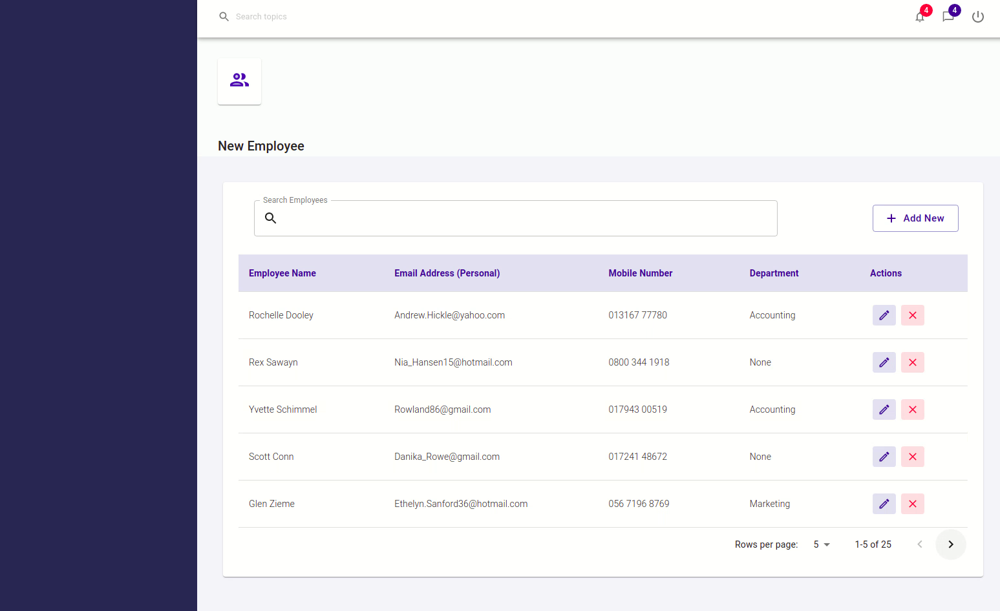
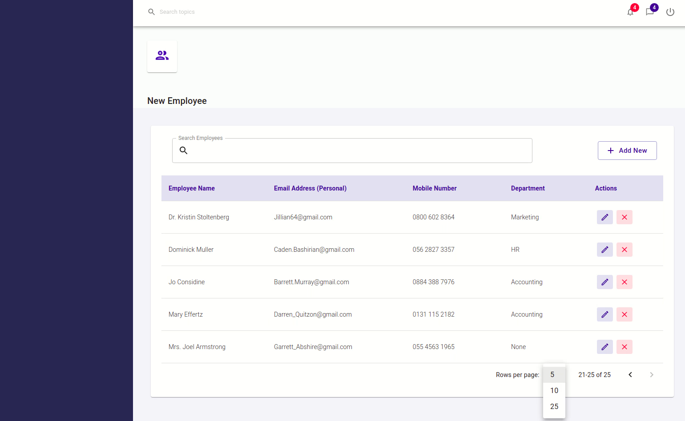
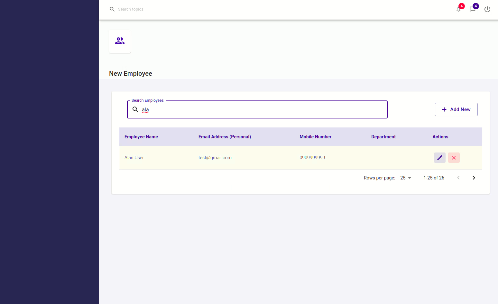
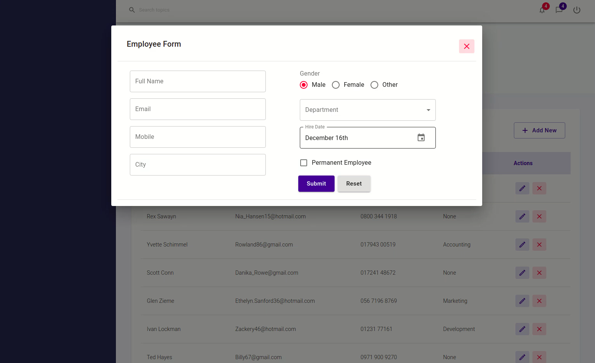
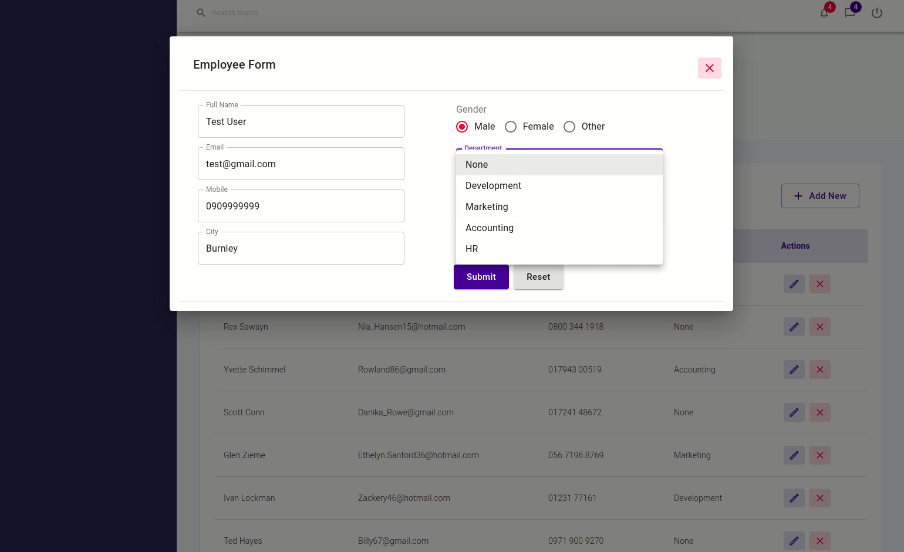
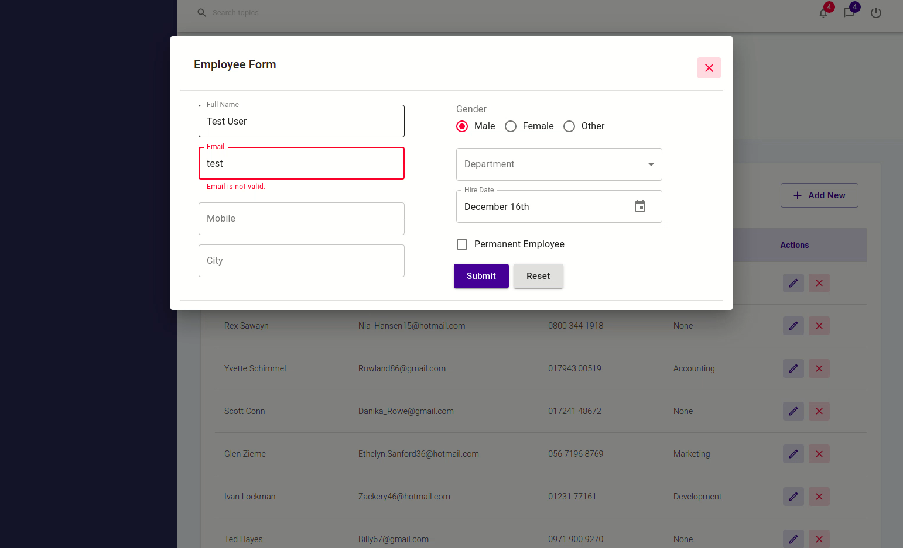
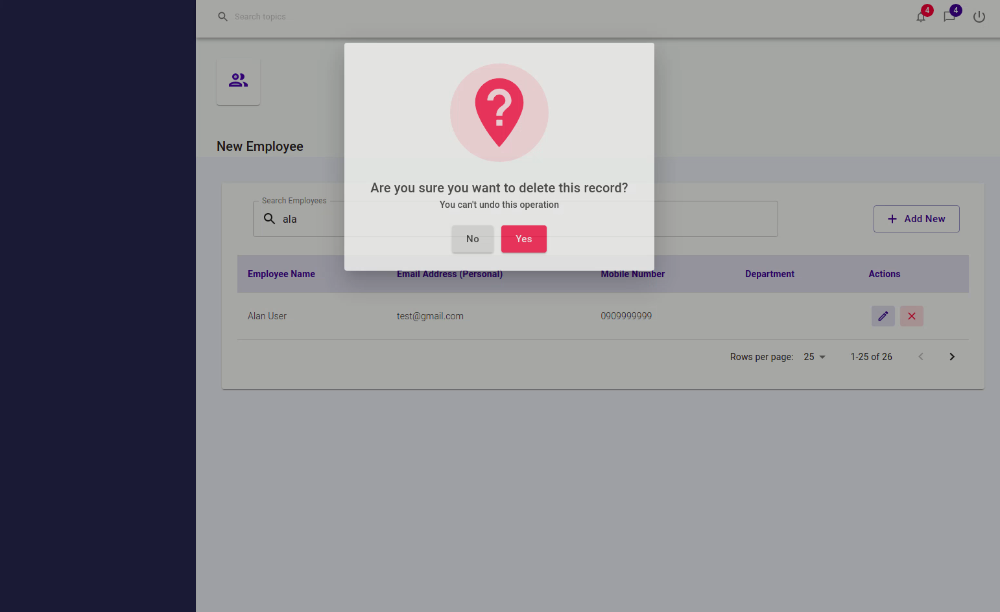

# Tasks

## Get familiar

Spend some time to familiarise yourself with the design

### List screen

Renders the employees from the API (50 or more)

> the blue square on the side is there for a future navigation menu, please include this placeholder blue square in your designs

Each page should feature pagination (default 15 employees per page)

Search feature allows a user to search employees by: Name, Email, Department

### Create screen

Allows a user to create a new employee

Department dropdown renders all the available departments from the database

Form features input validation

### Delete screen

List screen allows a user to delete the user

Triggers a confirmation screen

### Employee screen
View / Edit employee screen

Options:
- Reuse the create screen
- Remix the design with your own ideas

Form features input validation when editing

Department dropdown renders all the available departments from the database

## Architect

- Decide what UI library and framework you'd like to use. We use MeteorJS + Material UI internally, but we would recommend using NextJS and Material UI.

- Decide how you plan to deploy the UI, we recommend Github Pages or S3 deployment. 

- Consider what implications the deployment has on your UI.

- Split up you UI into components.

## Develop

- Match the designs as closely as possible, however feel free to add your own ideas into the mix (document the ideas in the repo)

- Commit early and often 

- Use semantic HTML tags where appropriate

- Structure your components following a pattern

- Make sure your components are small and reusable

- Use a UI framework for difficult components. but don't overuse frameworks

- Avoid magic numbers in styling

- Carefully consider responsiveness for desktop and mobile sizes

- Validate inputs on forms

- Use node modules to simply complex tasks, but don't overuse them e.g. for the client side search and form input validation

- Consider loading and error states

Optional:
- Consider component UI testing
- Consider end-to-end UI testing
